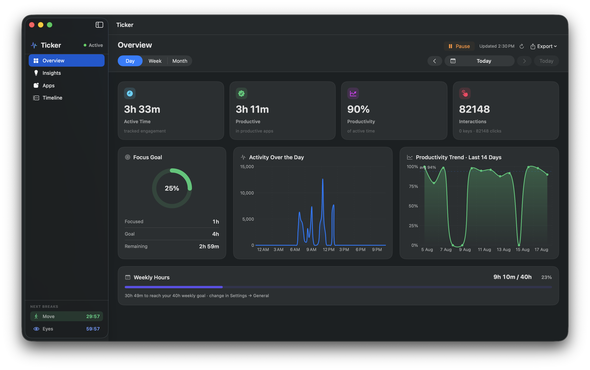
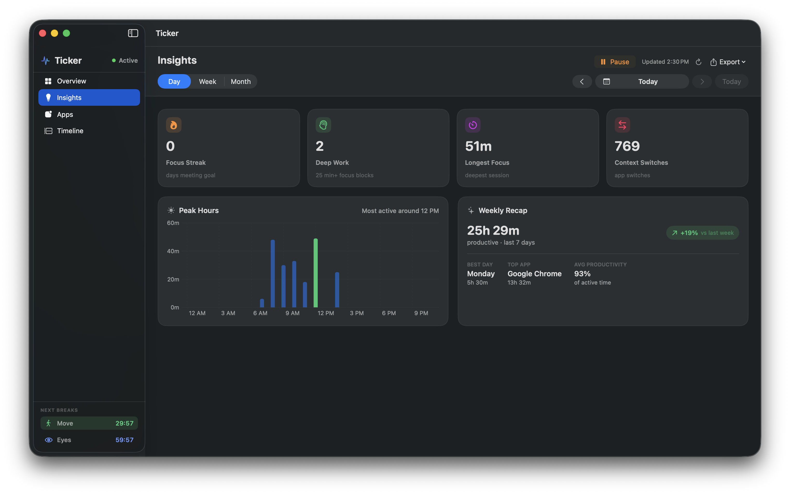
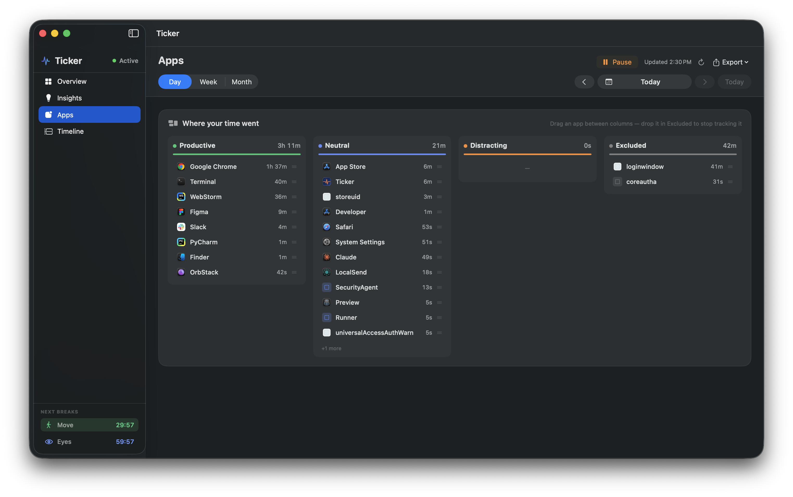
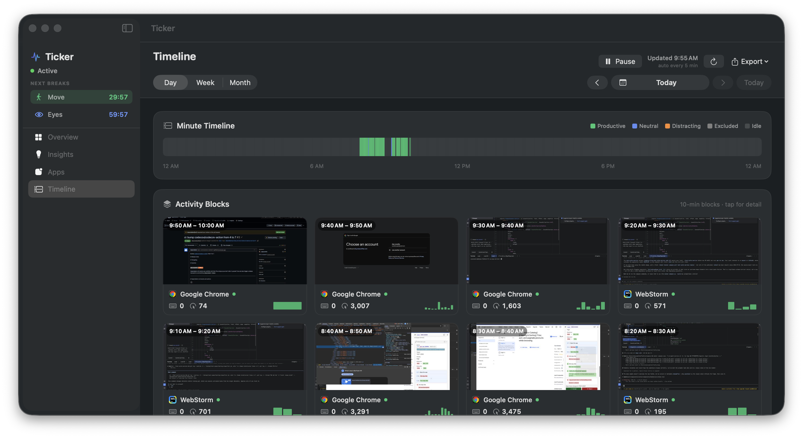

<div align="center">

<!-- Replace with your logo: docs/screenshots/logo.png (see docs/BRANDING.md) -->
# ⏱️ Ticker

### Your workday, measured privately.

**The private, native macOS time tracker** — focus, insights, and healthy-work
breaks, **100% on your Mac**. Nothing is ever uploaded.

A free, open-source, on-device **alternative to RescueTime, Timing, Rize, and
ActivityWatch** for macOS — no cloud, no account, no telemetry.

[](https://github.com/ajaysuwalka/ticker-app/actions/workflows/ci.yml)
[](https://github.com/ajaysuwalka/ticker-app/actions/workflows/codeql.yml)
[](https://github.com/ajaysuwalka/ticker-app/releases)
[](LICENSE)


[](CONTRIBUTING.md)

<br>

<a href="https://github.com/ajaysuwalka/ticker-app/releases/latest/download/Ticker-macOS.dmg">
  
</a>

<sub>Apple Silicon + Intel · signed &amp; notarized · macOS 14+ &nbsp;·&nbsp; or `brew install --cask ticker` &nbsp;·&nbsp; [all releases](https://github.com/ajaysuwalka/ticker-app/releases)</sub>

<br><br>



</div>

---

## Why Ticker?

Most time trackers either ship your keystrokes to the cloud (RescueTime, Rize,
Timing) or feel like a database with a UI (the venerable ActivityWatch). Ticker
is the one that's **native, beautiful, and 100% on-device** — and it folds
**focus tracking + wellness breaks** into the same app.

- 🔒 **Private by design.** Everything lives in `~/Library/Application Support/Ticker/`. No servers, no account, no telemetry. Ticker counts *how many* keys/clicks you make — **never which keys or what you type**.
- 🖥️ **Truly native.** SwiftUI + Swift Charts. A menu-bar companion and a full dashboard, at home on macOS.
- 🎯 **Real focus, not vanity minutes.** Focus counts *continuous* streaks, so the goal reflects deep work — not scattered productive seconds.
- 🧘 **Built-in wellness.** Configurable move & screen breaks with on-screen countdowns and ergonomics guidance.
- 🧠 **Smart about your day.** Knows the difference between *idle at your desk* (reviewable — was it a meeting?) and *away* (locked/asleep — not counted).
- ⚡ **Builds in ~10 seconds.** Distributed as source, so there's no "unidentified developer" wall.

---

## Features at a glance

| | |
|---|---|
| **Tracking** | Samples the frontmost app every second; counts keys/clicks; reads the active tab/project from the window title; detects idle vs. active vs. away. |
| **Categories** | Tag apps **Productive / Neutral / Distracting**, or **Excluded** to drop them entirely. Drag between columns. |
| **Dashboard** | Overview · Insights · Apps · Timeline — stat tiles, activity graph, a **Focus Goal** ring, productivity trend, peak hours, weekly recap, per-app breakdown, and a minute-level timeline. |
| **Focus** | Continuous-focus streaks (broken by gaps over 10 min), a daily goal, and a focus-streak counter. |
| **Wellness** | Configurable **move** and **screen** breaks with on-screen countdowns that auto-finish; ergonomics tips. |
| **Idle review** | Returned after 10+ min at your desk? Ticker asks if it was a meeting → count as productive, or delete it. |
| **Screen timeline** | *(optional, off by default)* a small screen thumbnail every N minutes, on-device only, auto-deleted. |
| **Export** | Weekly / Monthly **PDF** reports and a **CSV** of all data. |
| **Menu bar** | A compact panel with a live waveform, focus ring, current app, next-break countdown, and start/pause. |

> **📖 Want to know exactly how each widget decides what it shows?** Read the
> **[Widget & Metric Reference →](docs/WIDGETS.md)** — it documents every tile,
> chart, and countdown, and the logic behind each number (active vs. idle, focus
> streaks, categories, break timers, and more).

---

## Screenshots

| Overview | Insights |
|---|---|
|  |  |
| **Apps** | **Timeline** |
|  |  |

---

## Install

**macOS 14+.** Ticker is a **universal binary** (Apple Silicon + Intel).

### Homebrew (easiest)

```bash
brew tap ajaysuwalka/ticker https://github.com/ajaysuwalka/ticker-app
brew install --cask ticker
```

### Direct download

Grab the latest **[notarized `.dmg`](https://github.com/ajaysuwalka/ticker-app/releases/latest)**,
open it, and drag Ticker to Applications — it's signed with a Developer ID and
notarized by Apple, so there's no "unidentified developer" wall.

### Build from source

```bash
git clone https://github.com/ajaysuwalka/ticker-app.git && cd ticker-app
xcode-select --install                 # one-time, if you don't have Swift
./tools/make-signing-cert.sh           # one-time: stable permissions across rebuilds
./build.sh && open build/Ticker.app
```

Ticker appears in your **menu bar** (the pulse-wave icon) and opens its dashboard.
**More:** [INSTALL.md](INSTALL.md) · [GUIDE.md](GUIDE.md) · [ARCHITECTURE.md](ARCHITECTURE.md)

## Staying up to date

- **Homebrew:** `brew upgrade --cask ticker`.
- **In-app:** Ticker shows a banner when a newer version is out (its only network
  request — a version check to GitHub; no data is sent).
- **Get notified:** on this repo, click **Watch → Custom → Releases** for an email
  on every release.

### Permissions

Ticker works immediately for app usage and idle/active time. Two macOS
permissions unlock more, requested from within the app:

| Permission | Unlocks | Required? |
|---|---|---|
| **Accessibility** | Keystroke/click counts, window titles (tab/project) | Recommended |
| **Screen Recording** | The optional per-interval screen thumbnails | Only for Screen Timeline |

After granting either, **quit and reopen Ticker** (macOS applies the grant on the
next launch — the signing cert from step 3 means you only do this once).

---

## Privacy

Everything is stored locally in `~/Library/Application Support/Ticker/`
(`data.json` + a `shots/` thumbnail folder). **Your tracked data never leaves
your Mac.** Ticker counts *how many* keys/clicks you make — never *which* keys or
*what* you type. Screenshots are off unless you turn them on, and are
auto-deleted.

Ticker's **only** network request is an anonymous **version check** to GitHub, so
it can tell you when an update is available — it sends none of your data.

To wipe data: **Settings → Data → Clear all tracked data**, or delete the folder.

---

## Build, test & contribute

Ticker is a SwiftPM package. CI runs on every PR (build, tests, SwiftLint,
CodeQL) — see [`.github/workflows`](.github/workflows).

```bash
swift build -c release              # compile
swift test                          # unit tests (needs full Xcode)
swift test --enable-code-coverage   # + coverage (CI reports this)
swiftlint                           # lint
./build.sh                          # assemble + sign Ticker.app
```

CI measures line coverage with `llvm-cov`, uploads a `coverage.lcov` artifact,
and (optionally) pushes to Codecov — see [`ci.yml`](.github/workflows/ci.yml).

Contributions are very welcome — start with [CONTRIBUTING.md](CONTRIBUTING.md)
and the [`good first issue`](https://github.com/ajaysuwalka/ticker-app/labels/good%20first%20issue)
label. Please keep the **privacy promise**: no network calls, ever.

---

## Roadmap

- [x] Notarized, universal (Apple Silicon + Intel) signed releases
- [x] Homebrew cask
- [x] In-app update notifications
- [ ] Configurable dashboard layout
- [ ] More app-category heuristics
- [ ] Localizations

Have an idea? [Open a discussion](https://github.com/ajaysuwalka/ticker-app/discussions).

---

## Acknowledgments

Built by **Ajay Suwalka**, and **created with the tools provided by
[Testlio](https://testlio.com)** (including Claude Code) as part of day-to-day
engineering. Huge thanks to Testlio for the developer tooling that made building
Ticker possible.

> This is a personal open-source project and is **not an official Testlio
> product**. "Testlio" and the Testlio logo are trademarks of Testlio, used here
> only to credit the tooling.

## License

[MIT](LICENSE) © 2026 Ajay Suwalka

---

<sub>**Keywords:** macOS time tracker · app usage & activity tracker · focus timer & deep-work tracking · screen time · productivity analytics · menu bar app · wellness / break reminders · privacy-first · local-first / on-device · open source · SwiftUI · Apple Silicon + Intel · a free RescueTime / Timing / Rize / ActivityWatch alternative for Mac.</sub>
